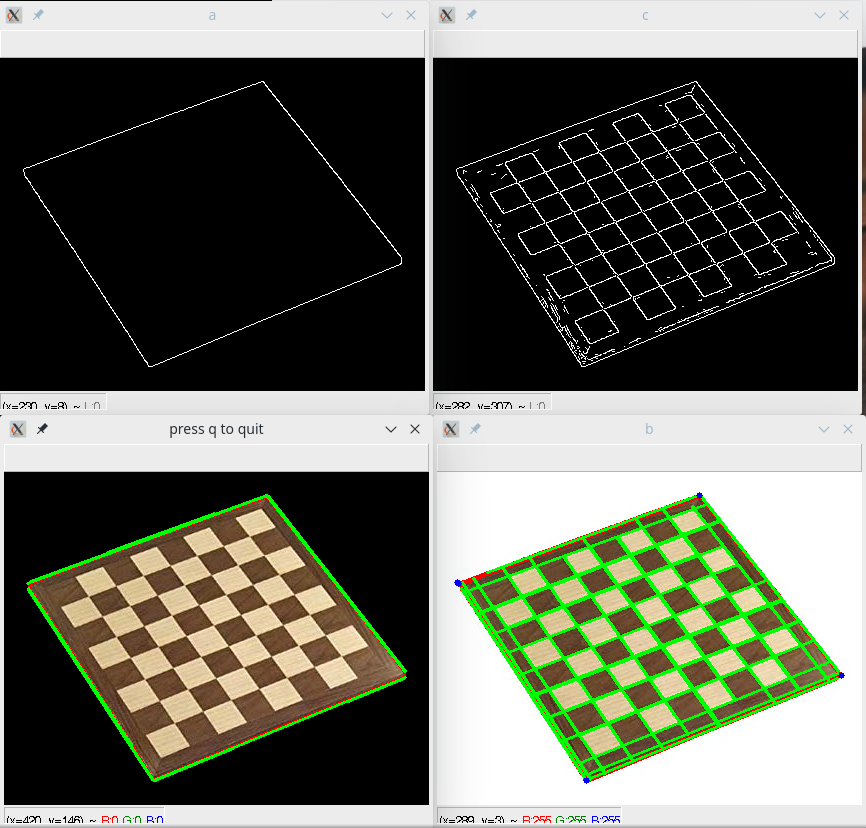

# Computer vision for detecting game boards
### Luke Zambella

### Introduction
A set of algorithms used to detect a standard chess or checkers board and be able to figure out the coordinates of each square.
The main board detection algorithm assumes that the chess board is the largest 4-sided object in a cameras frame-buffer. A mask is made from the contours of that
board and is used to mask out the board from the environment for further processing. The four corners of the game board is found using a canny edge detector on the mask
and then a hough transform to find the four lines. A function is called to find out where the four lines all intersect and it is assumed that those areas are near or at the corners.

The ultimate goal of this project is to be able to map each individual square of a chess board to a pixel coordinate so a robot can be able to pick and place from any to any square.
### Known issues
* The chess board assumes that the largest square is the board and whle this is true, the actual game area may be smaller.
* Four corners method is not fully correct yet

### Example output
 
